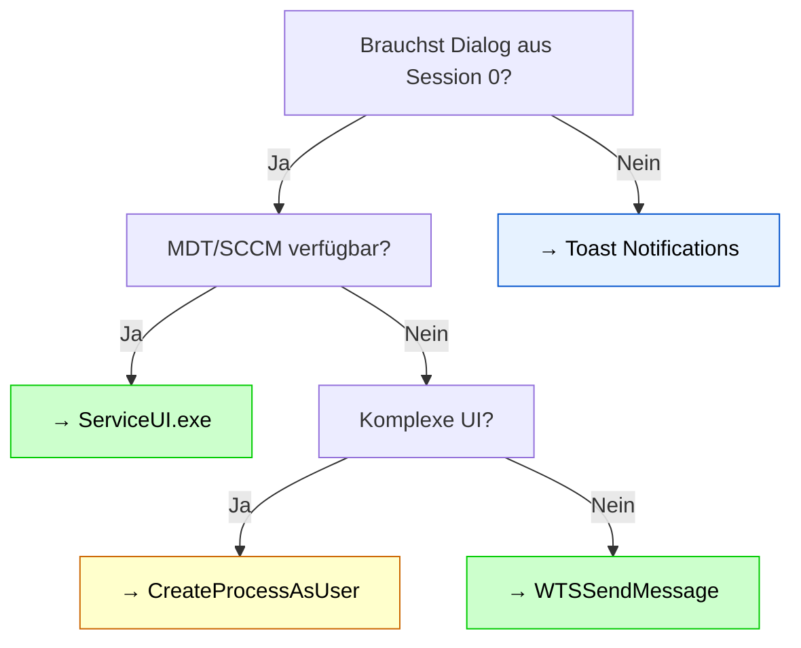

# Session 0 — Dialog-Anzeige unter Windows

Dokumentation zu Möglichkeiten, um aus dem Systemkontext (Session 0) heraus Dialoge und Benutzerinteraktionen auf dem Windows-Desktop anzuzeigen.

## Das Problem

Seit Windows Vista / Server 2008 existiert **Session 0 Isolation** — Services und Systemdienste laufen isoliert von Benutzer-Desktops:

```
Session 0 (SYSTEM)          Session 1+ (Benutzer)
├─ services.exe             ├─ explorer.exe
├─ Scheduled Tasks          ├─ User-Apps
└─ ❌ Keine UI zum User    └─ ✅ Sichtbarer Desktop
```

Ein PowerShell-Skript, das als SYSTEM läuft (z.B. Scheduled Task, Boot-Script), **kann nicht einfach** Dialoge zeigen — diese bleiben unsichtbar.

## Die Lösungen

Dieses Projekt dokumentiert **5 Haupttechniken**, um diese Isolation zu überbrücken:

| Technik | Komplexität | Best For | Details |
|---------|-------------|----------|---------|
| **ServiceUI.exe** | 🟢 Sehr niedrig | Enterprise Deployment (MDT, SCCM) | [→ Lösungen](docs/Loesungen.md#1-serviceui) |
| **CreateProcessAsUser** | 🔴 Hoch | Universelle, komplexe UI | [→ Lösungen](docs/Loesungen.md#2-createprocessasuser) |
| **WTSSendMessage** | 🟡 Mittel | Einfache Dialoge (OK/Yes/No) | [→ Lösungen](docs/Loesungen.md#3-wtssendmessage) |
| **Toast Notifications** | 🟢 Niedrig | Benachrichtigungen (User-Context) | [→ Lösungen](docs/Loesungen.md#4-toast-notifications) |
| **PsExec / WinRM** | 🟢 Niedrig | Quick & Dirty, Alternativen | [→ Lösungen](docs/Loesungen.md#5-psexec--winrm) |

## Dokumentation

- **[Lösungen](docs/Loesungen.md)** — Detaillierte Erklärung aller 5 Techniken mit Beispielen
- **[Szenarien](docs/Szenarien.md)** — Real-World Use Cases (Security Updates, Deployment, Multi-User RDP)
- **[Code-Beispiele](docs/CodeBeispiele.md)** — Produktionsreife PowerShell-Funktionen (Copy-Paste ready)
- **[Troubleshooting](docs/Troubleshooting.md)** — Fehlerbehandlung, FAQ, Lösungen für häufige Probleme

## Quick Start

### Einfache Bestätigungsdialog (WTSSendMessage)

```powershell
# Im Scheduled Task als SYSTEM
Add-Type -TypeDefinition @'
using System;
using System.Runtime.InteropServices;
public class WTS {
    [DllImport("wtsapi32.dll", SetLastError=true)]
    public static extern IntPtr WTSOpenServer(string ServerName);
    [DllImport("wtsapi32.dll", SetLastError=true)]
    public static extern bool WTSSendMessage(IntPtr hServer, uint SessionId, 
        string pTitle, uint TitleLength, string pMessage, uint MessageLength, 
        uint Style, uint TimeOut, out uint pResponse, bool bWait);
}
'@

$hServer = [WTS]::WTSOpenServer("localhost")
$response = 0
[WTS]::WTSSendMessage($hServer, 1, "Frage", 5, "Neustart?", 9, 4, 30, [ref]$response, $true)

if ($response -eq 6) { Restart-Computer -Force }  # IDYES
```

### Mit ServiceUI.exe (MDT)

```powershell
ServiceUI.exe powershell.exe -NoProfile -ExecutionPolicy Bypass -File C:\Scripts\ShowDialog.ps1
```

## Entscheidungsbaum



## Lokale HTML-Dokumentation

Für lokale Offline-Nutzung existiert eine interaktive HTML-Version (`Dokumentation.html`) mit:
- Dark/Light Mode Toggle
- Mermaid-Diagrammen für Prozessflüsse
- Vollständigen Code-Beispielen
- Erweiterte Architektur-Diagramme

Diese wird nicht in Git versioniert, kann aber lokal angewendet werden.

## Weitere Ressourcen

- [Microsoft: Session 0 Isolation](https://learn.microsoft.com/en-us/windows/win32/services/interactive-services)
- [Alex Ionescu: Inside Session 0 Isolation](https://www.alex-ionescu.com/)
- [MDT (Microsoft Deployment Toolkit)](https://www.microsoft.com/en-us/download/details.aspx?id=54259)

---

**Autor:** Claude Sonnet 4.6 | **Stand:** Mai 2026
