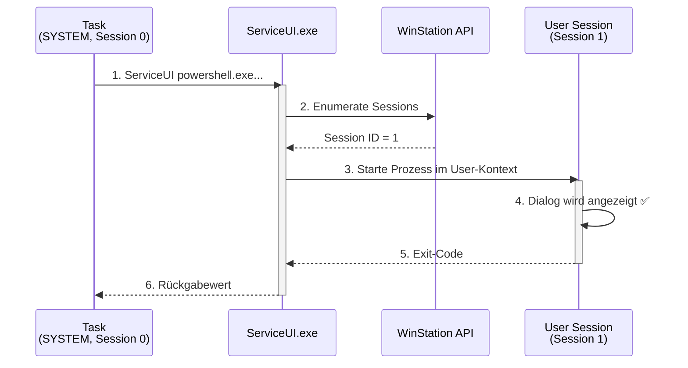
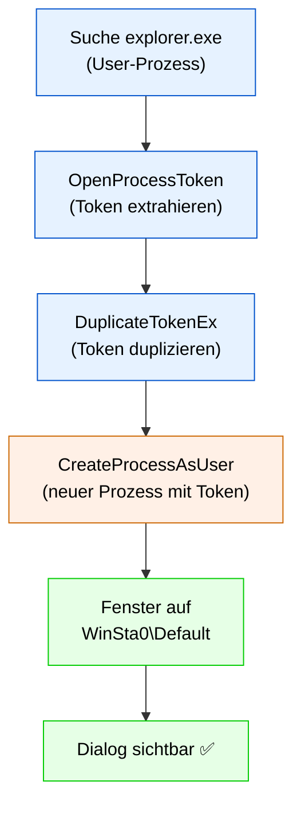
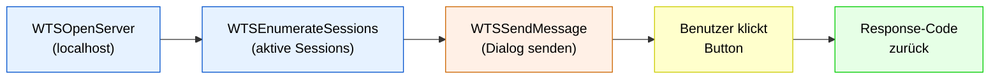
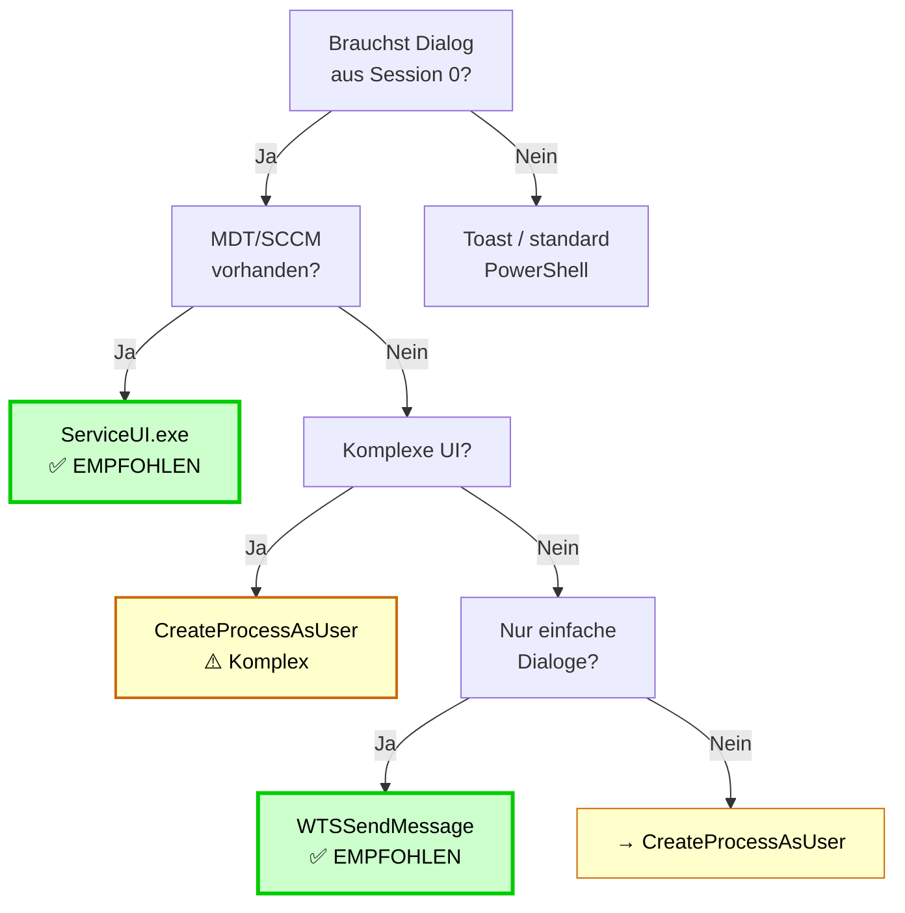

# Session 0 Lösungen

Detaillierte Erklärung aller 5 Techniken zur Dialog-Anzeige aus dem Systemkontext.

## 1. ServiceUI.exe (Microsoft Deployment Toolkit)

### Was ist ServiceUI.exe?

**ServiceUI.exe** ist ein Programm aus dem Microsoft Deployment Toolkit (MDT), das als "Session-Bridge" fungiert. Es erkennt automatisch die Session des angemeldeten Benutzers und startet ein Kind-Prozess in dessen Kontext.

### Prozessablauf



### Charakteristiken

- ✅ Automatische Session-Detection
- ✅ Einfache Nutzung (ein Befehl voraus)
- ✅ Standard in Enterprise-Szenarien
- ✅ Wartet auf Kind-Prozess
- ⚠️ Benötigt MDT/SCCM oder separate Installation

### Befehlszeile

```powershell
# Basis
ServiceUI.exe powershell.exe -NoProfile -ExecutionPolicy Bypass -File C:\Scripts\Dialog.ps1

# Mit Prozess-Referenz
ServiceUI.exe -process:explorer.exe powershell.exe -NoProfile -File C:\Scripts\Dialog.ps1
```

### Im Scheduled Task

```powershell
$action = New-ScheduledTaskAction -Execute 'C:\MDT\ServiceUI.exe' `
    -Argument 'powershell.exe -NoProfile -ExecutionPolicy Bypass -File C:\Scripts\ShowDialog.ps1'

$trigger = New-ScheduledTaskTrigger -AtStartup
$trigger.Delay = "PT2M"  # 2 Min Verzögerung (Benutzer-Anmeldung)

Register-ScheduledTask -TaskName 'MyTask' -User 'SYSTEM' `
    -Action $action -Trigger $trigger -RunLevel Highest
```

### Voraussetzungen

- MDT oder SCCM installiert
- ServiceUI.exe erreichbar
- Windows Vista+

**Empfehlung:** ⭐ Standard für Enterprise-Deployment

---

## 2. CreateProcessAsUser (C# in PowerShell)

### Was ist CreateProcessAsUser?

Eine Windows-API aus `kernel32.dll`, die Prozesse unter Benutzer-Token starten kann. PowerShell nutzt C# P/Invoke, um die API direkt aufzurufen.

### Token-basierte Injection



### Vor- und Nachteile

| Pro | Contra |
|-----|--------|
| Keine externe Datei | Komplexer Code |
| Ohne MDT/SCCM | Token-Handling kritisch |
| Sehr flexibel | Admin-Rechte erforderlich |
| Dialog direkt sichtbar | Fehlerträchtig |

### Basis-Konzept

```powershell
# 1. Finde explorer.exe (aktiver User)
$explorer = Get-Process -Name explorer | Select-Object -First 1

# 2. Öffne und extrahiere Token
$hProcess = OpenProcess($explorer.Id)
OpenProcessToken($hProcess, $DESIRED_ACCESS, [ref]$hToken)

# 3. Dupliziere Token
DuplicateTokenEx($hToken, ..., [ref]$hDupToken)

# 4. Starte Prozess mit Token
CreateProcessAsUser($hDupToken, "powershell.exe", "...", ..., "WinSta0\Default", ...)

# 5. Cleanup
CloseHandle($hToken)
CloseHandle($hDupToken)
```

**Empfehlung:** ⭐⭐ Universell, aber komplex

---

## 3. WTSSendMessage

### Was ist WTSSendMessage?

Eine Terminal Services API (`wtsapi32.dll`) für Services, um einfache Nachrichten-Boxen auf den Benutzer-Desktop zu senden.

### Ablauf



### Charakteristiken

- ✅ Vordefinierte Button-Sets (OK, Yes/No, Retry/Cancel)
- ✅ Einfach zu implementieren
- ✅ Rückgabewert (welcher Button)
- ✅ Timeout möglich
- ❌ Nur einfache Dialoge (keine Custom UI)

### Button-Konstanten

| Wert | Bedeutung |
|------|-----------|
| 0 | OK |
| 1 | OK / Cancel |
| 4 | Yes / No |
| 5 | Retry / Cancel |
| 6 | Abort / Retry / Ignore |

### Response-Codes

| Code | Button |
|------|--------|
| 1 | OK |
| 2 | Cancel |
| 3 | Abort |
| 4 | Retry |
| 5 | Ignore |
| 6 | Yes |
| 7 | No |
| 10 | Timeout |

**Empfehlung:** ⭐⭐⭐ Einfach & schnell für unkomplizierte Dialoge

---

## 4. Toast Notifications

### Das Problem mit Session 0

Toast Notifications **funktionieren nicht direkt** aus Session 0:
- Benötigen Benutzer-Session (1+)
- Brauchen User-Profile Registry
- WinRT API nur im User-Kontext verfügbar

### Lösung: Wrapper über CreateProcessAsUser oder ServiceUI

```powershell
# Schritt 1: CreateProcessAsUser / ServiceUI startet Skript im User-Kontext
ServiceUI.exe powershell.exe -NoProfile -File C:\Scripts\Toast.ps1

# Schritt 2: Im Toast.ps1 (läuft im User-Context)
[Windows.UI.Notifications.ToastNotificationManager, Windows.UI.Notifications, ContentType = WindowsRuntime] > $null

$xml = New-Object Windows.Data.Xml.Dom.XmlDocument
$xml.LoadXml(@"
<toast>
    <visual>
        <binding template="ToastText02">
            <text id="1">Titel</text>
            <text id="2">Nachricht</text>
        </binding>
    </visual>
</toast>
"@)

[Windows.UI.Notifications.ToastNotificationManager]::CreateToastNotifier("PowerShell").Show(
    (New-Object Windows.UI.Notifications.ToastNotification $xml)
)
```

**Empfehlung:** ⭐ Nur Benutzer-Session, aber modern

---

## 5. PsExec & WinRM

### PsExec mit -i Flag

```powershell
psexec.exe \\. -i -s powershell.exe -Command "Add-Type -AssemblyName System.Windows.Forms; ..."
```

**Vorteil:** Quick & Dirty, aber benötigt Sysinternals-Tools

### WinRM (PowerShell Remoting)

```powershell
Invoke-Command -ComputerName localhost -ScriptBlock {
    Add-Type -AssemblyName System.Windows.Forms
    [System.Windows.Forms.MessageBox]::Show("Dialog")
}
```

**Vorteil:** Windows-native, keine zusätzlichen Tools

---

## Vergleich aller Techniken



---

Siehe auch: [Code-Beispiele](CodeBeispiele.md) | [Szenarien](Szenarien.md) | [Troubleshooting](Troubleshooting.md)
