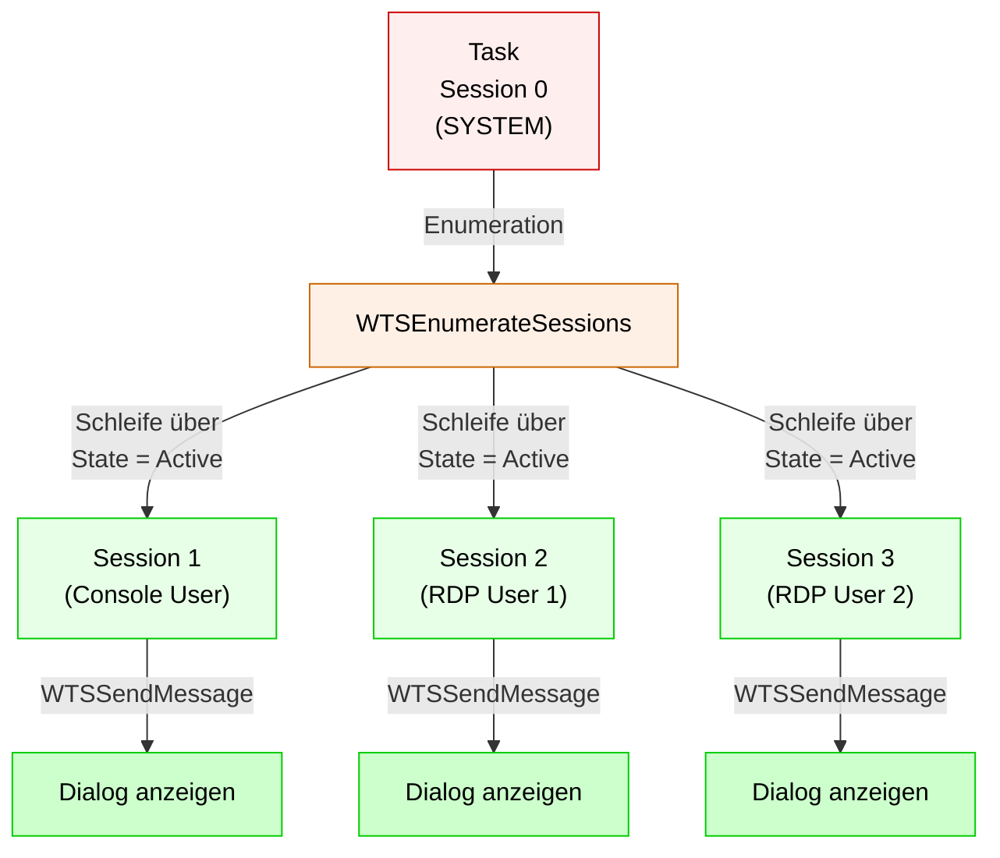

# Real-World Szenarien

Praktische Anwendungsfälle mit Implementierungs-Hinweisen.

## 1. Sicherheitsupdate mit Bestätigungsdialog

**Situation:** Beim Systemstart soll der Benutzer gefragt werden, ob ein kritisches Sicherheitsupdate sofort installiert werden soll.

### Problem & Lösung

```
❌ Problem: Task läuft VOR Benutzer-Anmeldung (Session 0 noch allein)
✅ Lösung: Task-Trigger auf "Bei Benutzer-Anmeldung" oder mit Verzögerung
```

### Implementierung mit WTSSendMessage

```powershell
# Scheduled Task als SYSTEM
# Trigger: Bei Benutzer-Anmeldung (oder Startup + 2 Min Verzögerung)

Add-Type -TypeDefinition @'
using System;
using System.Runtime.InteropServices;
public class WTS {
    [DllImport("wtsapi32.dll", SetLastError=true)]
    public static extern IntPtr WTSOpenServer(string ServerName);
    [DllImport("wtsapi32.dll", SetLastError=true)]
    public static extern bool WTSSendMessage(IntPtr hServer, uint SessionId, string pTitle,
        uint TitleLength, string pMessage, uint MessageLength, uint Style, uint TimeOut,
        out uint pResponse, bool bWait);
    [DllImport("wtsapi32.dll", SetLastError=true)]
    public static extern void WTSCloseServer(IntPtr hServer);
}
'@ -ErrorAction SilentlyContinue

$hServer = [WTS]::WTSOpenServer("localhost")
$response = 0
$msg = "Kritisches Sicherheitsupdate. Sofort installieren und neu starten?"

$success = [WTS]::WTSSendMessage($hServer, 1, "Sicherheitsupdate", 17, $msg, $msg.Length, 4, 300, [ref]$response, $true)
[WTS]::WTSCloseServer($hServer)

if ($response -eq 6) {  # IDYES
    Write-Host "Update wird eingeleitet..."
    # Windows Update starten
    Start-Process -FilePath "$env:windir\System32\sfc.exe" -ArgumentList "/scannow"
    Start-Sleep -Seconds 10
    Restart-Computer -Force
} else {
    Write-Host "Benutzer hat Update abgelehnt"
}
```

### Alternative mit ServiceUI

```powershell
$serviceUIPath = "C:\Program Files\Microsoft Deployment Toolkit\Templates\ServiceUI\ServiceUI.exe"

$dialogScript = @'
Add-Type -AssemblyName System.Windows.Forms
$result = [System.Windows.Forms.MessageBox]::Show(
    "Kritisches Sicherheitsupdate. Sofort installieren?",
    "Sicherheitsupdate",
    [System.Windows.Forms.MessageBoxButtons]::YesNo,
    [System.Windows.Forms.MessageBoxIcon]::Warning
)
exit [int]($result -eq [System.Windows.Forms.DialogResult]::Yes)
'@

$tempScript = "$env:TEMP\update_dialog_$([guid]::NewGuid()).ps1"
$dialogScript | Out-File -FilePath $tempScript -Encoding UTF8 -Force

& $serviceUIPath powershell.exe -NoProfile -ExecutionPolicy Bypass -File $tempScript
$exitCode = $LASTEXITCODE

Remove-Item $tempScript -Force -ErrorAction SilentlyContinue

if ($exitCode -eq 1) {
    Restart-Computer -Force
}
```

---

## 2. Software-Deployment mit Progress-Anzeige

**Situation:** SCCM/Intune deployt eine größere Anwendung. Der Benutzer soll Live-Progress sehen (nicht nur "lädt...").

### Mit ServiceUI & WPF

```powershell
# Im SCCM/Intune Deployment
ServiceUI.exe powershell.exe -NoProfile -ExecutionPolicy Bypass -File "C:\Deploy\Install-AppWithProgress.ps1"

# ===== Install-AppWithProgress.ps1 =====
Add-Type -AssemblyName PresentationFramework, System.Windows.Forms

$window = New-Object System.Windows.Window
$window.Title = "Microsoft 365 Installation"
$window.Width = 400
$window.Height = 150
$window.WindowStartupLocation = "CenterScreen"
$window.Background = [System.Windows.Media.Brushes]::White

$stackPanel = New-Object System.Windows.Controls.StackPanel
$stackPanel.Margin = "20"
$stackPanel.VerticalAlignment = "Center"

$label = New-Object System.Windows.Controls.Label
$label.Content = "Installiere Microsoft 365..."
$label.FontSize = 14
$label.Margin = "0,0,0,10"

$progressBar = New-Object System.Windows.Controls.ProgressBar
$progressBar.Height = 30
$progressBar.Minimum = 0
$progressBar.Maximum = 100

$statusLabel = New-Object System.Windows.Controls.Label
$statusLabel.Content = "0%"
$statusLabel.HorizontalAlignment = "Center"
$statusLabel.Margin = "0,10,0,0"

$stackPanel.AddChild($label)
$stackPanel.AddChild($progressBar)
$stackPanel.AddChild($statusLabel)

$window.Content = $stackPanel

# Zeige Fenster (non-modal)
$window.Show()
[System.Windows.Forms.Application]::Current.Dispatcher.BeginInvoke([Action]{}).Wait()

# Installationsprozess
for ($i = 0; $i -le 100; $i += 5) {
    $progressBar.Value = $i
    $statusLabel.Content = "$i%"
    [System.Windows.Forms.Application]::Current.Dispatcher.Invoke([Action]{ })
    Start-Sleep -Milliseconds 500
}

$progressBar.Value = 100
$statusLabel.Content = "Abgeschlossen!"
Start-Sleep -Seconds 2
$window.Close()
```

---

## 3. Wartungs-Ankündigung mit Countdown

**Situation:** Automatischer Patch-Tag. 1 Stunde vor Neustart soll der Benutzer gewarnt werden.

### Mit Countdown-Dialog

```powershell
# Scheduled Task 1 Stunde vor Neustart

Add-Type -AssemblyName System.Windows.Forms

$form = New-Object System.Windows.Forms.Form
$form.Text = "Wartung anstehend"
$form.Width = 400
$form.Height = 250
$form.FormBorderStyle = "FixedDialog"
$form.MaximizeBox = $false
$form.MinimizeBox = $false
$form.StartPosition = "CenterScreen"
$form.TopMost = $true

$label1 = New-Object System.Windows.Forms.Label
$label1.Text = "System-Wartung"
$label1.Font = New-Object System.Drawing.Font("Arial", 16, [System.Drawing.FontStyle]::Bold)
$label1.Location = New-Object System.Drawing.Point(20, 20)
$label1.Size = New-Object System.Drawing.Size(350, 40)

$label2 = New-Object System.Windows.Forms.Label
$label2.Text = "Das System wird in 60 Minuten neu gestartet.`nSpeichern Sie Ihre Arbeit!"
$label2.Location = New-Object System.Drawing.Point(20, 70)
$label2.Size = New-Object System.Drawing.Size(350, 60)

$labelCountdown = New-Object System.Windows.Forms.Label
$labelCountdown.Text = "Verbleibende Zeit: 60:00"
$labelCountdown.Font = New-Object System.Drawing.Font("Arial", 14, [System.Drawing.FontStyle]::Bold)
$labelCountdown.ForeColor = [System.Drawing.Color]::Red
$labelCountdown.Location = New-Object System.Drawing.Point(20, 140)
$labelCountdown.Size = New-Object System.Drawing.Size(350, 40)

$buttonOK = New-Object System.Windows.Forms.Button
$buttonOK.Text = "OK"
$buttonOK.DialogResult = [System.Windows.Forms.DialogResult]::OK
$buttonOK.Location = New-Object System.Drawing.Point(150, 190)
$buttonOK.Size = New-Object System.Drawing.Size(100, 30)

$timer = New-Object System.Windows.Forms.Timer
$timer.Interval = 1000
$remainingSeconds = 3600  # 60 Minuten

$timer.Add_Tick({
    $remainingSeconds--
    $minutes = [Math]::Floor($remainingSeconds / 60)
    $seconds = $remainingSeconds % 60
    $labelCountdown.Text = "Verbleibende Zeit: {0:00}:{1:00}" -f $minutes, $seconds
    
    if ($remainingSeconds -le 0) {
        $timer.Stop()
        $form.Close()
        Restart-Computer -Force
    }
})

$form.Controls.AddRange(@($label1, $label2, $labelCountdown, $buttonOK))
$timer.Start()

[void]$form.ShowDialog()
```

---

## 4. Multi-User RDP Umgebung

**Situation:** Terminal Server mit mehreren RDP-Benutzern. Nachricht soll an ALLE oder spezifische Benutzer gehen.

### Nachricht an alle aktiven Sessions

```powershell
# Task auf RDS Broker Server als SYSTEM

Add-Type -TypeDefinition @'
using System;
using System.Runtime.InteropServices;

public class WTSEnum {
    [DllImport("wtsapi32.dll", SetLastError=true)]
    public static extern bool WTSEnumerateSessions(IntPtr hServer, uint Reserved, uint Version,
        out IntPtr ppSessionInfo, out uint pCount);
    [DllImport("wtsapi32.dll", SetLastError=true)]
    public static extern void WTSFreeMemory(IntPtr pMemory);
    [DllImport("wtsapi32.dll", SetLastError=true)]
    public static extern IntPtr WTSOpenServer(string ServerName);
    [DllImport("wtsapi32.dll", SetLastError=true)]
    public static extern void WTSCloseServer(IntPtr hServer);
    [DllImport("wtsapi32.dll", SetLastError=true)]
    public static extern bool WTSSendMessage(IntPtr hServer, uint SessionId, string pTitle,
        uint TitleLength, string pMessage, uint MessageLength, uint Style, uint TimeOut,
        out uint pResponse, bool bWait);

    [StructLayout(LayoutKind.Sequential)]
    public struct WTS_SESSION_INFO {
        public uint SessionId;
        [MarshalAs(UnmanagedType.LPStr)]
        public string pWinStationName;
        public uint State;  // 0=Active, 1=Connected, 2=ConnectQuery, 4=Disconnected
    }
}
'@ -ErrorAction SilentlyContinue

$hServer = [WTSEnum]::WTSOpenServer("localhost")
$pSessionInfo = 0
$pCount = 0

if ([WTSEnum]::WTSEnumerateSessions($hServer, 0, 1, [ref]$pSessionInfo, [ref]$pCount)) {
    $sessionSize = [System.Runtime.InteropServices.Marshal]::SizeOf([typeof]WTSEnum+WTS_SESSION_INFO)
    
    for ($i = 0; $i -lt $pCount; $i++) {
        $session = [System.Runtime.InteropServices.Marshal]::PtrToStructure(
            [IntPtr]($pSessionInfo.ToInt64() + $i * $sessionSize),
            [typeof]WTSEnum+WTS_SESSION_INFO)
        
        if ($session.State -eq 0 -or $session.State -eq 1) {  # Active oder Connected
            Write-Host "Sende Nachricht an Session $($session.SessionId) ($($session.pWinStationName))"
            
            $response = 0
            [WTSEnum]::WTSSendMessage($hServer, $session.SessionId, "Server-Wartung", 14,
                "Server wird in 15 Minuten neu gestartet. Speichern Sie Ihre Arbeit!",
                65, 0, 0, [ref]$response, $false)
        }
    }
    
    [WTSEnum]::WTSFreeMemory($pSessionInfo)
}

[WTSEnum]::WTSCloseServer($hServer)
```

### Nachricht nur an bestimmten Benutzer

```powershell
# Wenn Du nur einen bestimmten Benutzer (z.B. Session 2) erreichen möchtest:
$sessionId = 2  # oder dynamisch ermittelt

$hServer = [WTSEnum]::WTSOpenServer("localhost")
$response = 0

[WTSEnum]::WTSSendMessage($hServer, $sessionId, "Nur für dich", 11,
    "Diese Nachricht sieht nur Session $sessionId",
    44, 0, 0, [ref]$response, $true)

[WTSEnum]::WTSCloseServer($hServer)
```

---

## Architecture: Session 0 → Multi-User



---

Siehe auch: [Lösungen](Loesungen.md) | [Code-Beispiele](CodeBeispiele.md) | [Troubleshooting](Troubleshooting.md)
